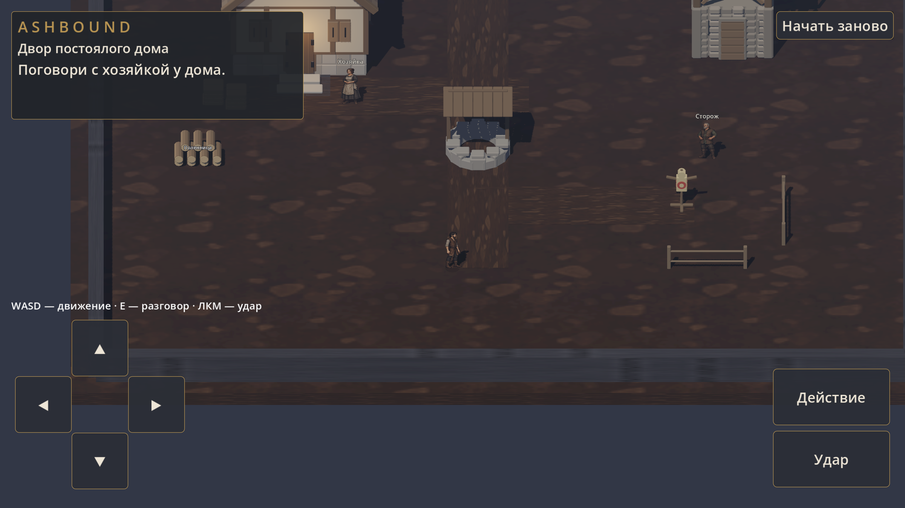
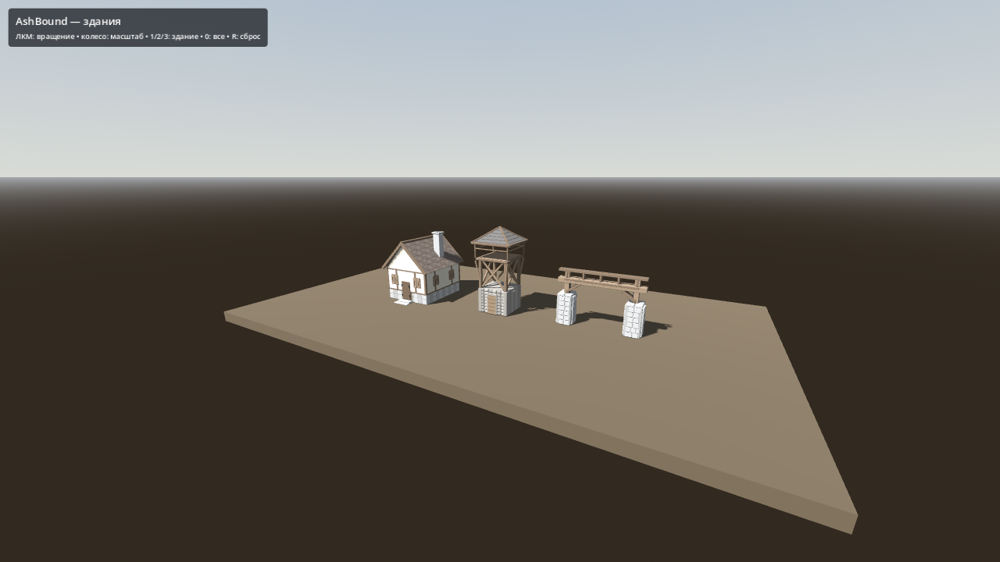

# AshBound

Мрачная одиночная RPG о разрушенном королевстве, борьбе фракций и пробуждении древней угрозы. Планируемые платформы с начала разработки — **ПК и Android**.

Художественное направление: **3D-мир и анимированные 2D-герой и NPC**, с видимой сменой одежды и оружия. Плавное окружение сочетается с намеренно редкой сменой поз в духе старой рисованной мультипликации. В первом дворе уже работает 2D-герой с ходьбой в 15 поз/с и два рисованных жителя; смена экипировки и полный набор направлений ещё впереди. [Подробности](docs/art/VISUAL_DIRECTION.md).

Текущее состояние: собран небольшой играбельный прототип — **двор постоялого дома**. Хозяйка даёт работу за ночлег, затем сторож предлагает тренировку. Это проверка раннего игрового цикла с простыми материалами; полноценный стартовый район ещё проектируется. [Результаты проверок и ограничения](docs/production/COURTYARD_CHECKS.md).

Разработка: отдельная новая ветка для каждой фичи → проверка → слияние в `dev`. В `main` переносим только проверенные играбельные билды как промежуточные итоги.

- [Память проекта](MEMORY.md) — договорённости и откуда продолжать.
- [Правила работы](AGENTS.md) — локальная Ollama выполняет игровой код, сцены и Blender-геометрию.
- [Документы разработки](docs/README.md) — сюжет, первый эпизод, этапы и очередь.
- [Модели и демонстрация](art/blender/README.md) — исходники, экспорт, проверки и повторная сборка.
- [Восстановление инструментов](tools/README.md) и [подключения на текущем компьютере](GODOT_CONNECTION.md).

## Поиграть в первый двор

Открыть `project.godot` в Godot 4.7.2 и нажать **F5**. Или открыть `scenes/courtyard/first_courtyard.tscn` и нажать **F6**.

**WASD** — движение, **E** — действие рядом с жителем или поленницей, **ЛКМ** — удар. На Android используются экранные стрелки, «Действие» и «Удар». Реплика закрывается нажатием на её панель. «Начать заново» сбрасывает упражнение; прогресс между запусками пока не сохраняется.

[Устройство сцены и места для правок](docs/levels/FIRST_COURTYARD.md) · [Сборки Windows и Android](docs/production/BUILDS.md).

## Посмотреть здания

Открыть сцену `scenes/environments/building_showcase.tscn` и нажать **F6**. Здания появляются при запуске. **1/2/3** — выбрать здание, **0** — общий вид, **ЛКМ** — вращение, **колесо** — масштаб. Прежняя основная сцена сохранена в `scenes/environments/test_world.tscn`.

Редактируемые модели: `art/blender/output/*.blend`. Импорт для Godot: `assets/buildings/ashbound/*.glb`. Материалы пока простые; интерьеры, анимация дверей и финальная оптимизация остаются будущими задачами.
