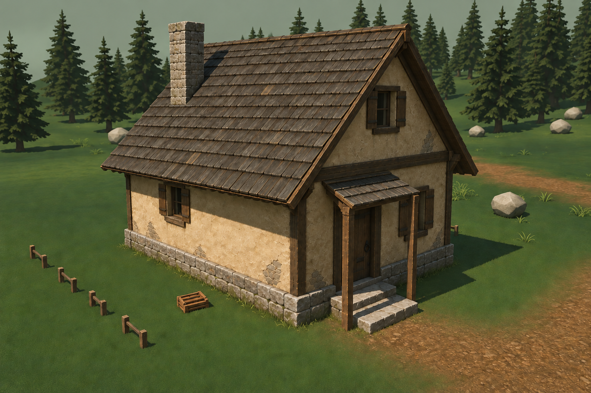
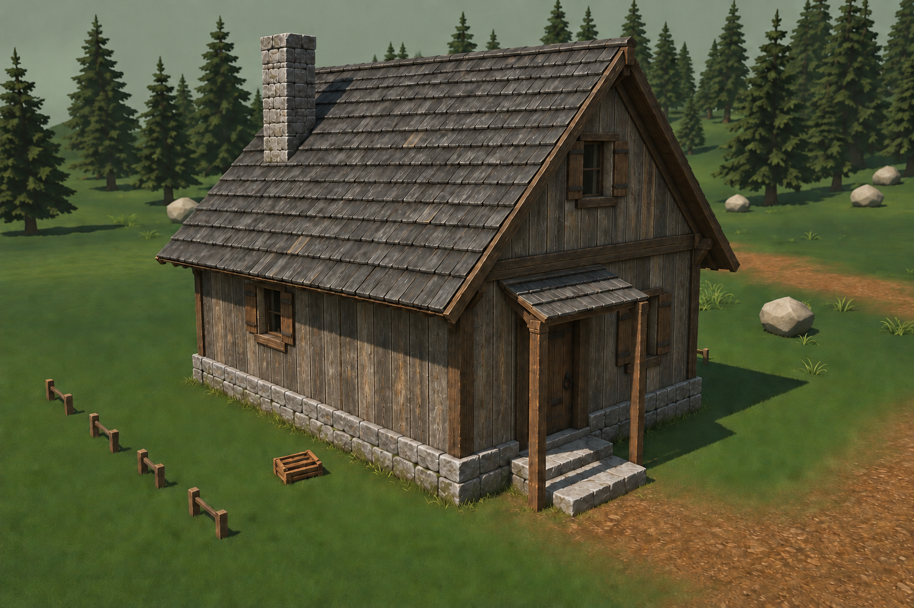

# H01 — отделка лесного дома, v1

**Вариант А принят владельцем, D-077 от 24 сентября.** [Карточка](../../../docs/production/VILLAGE_MATERIAL_STUDY_01_TASK.md). После принятого ветра D-076 готовим вид существующего дома перед сменой игровых материалов.

Открыть локальный лист · [А крупно](h01-material-a.png) · [Б крупно](h01-material-b.png) · Текущий дом в игре

## А — штукатурка и тёмная дранка

Тёплая старая штукатурка, тёмный дуб, деревянная кровля и каменный цоколь. Исправный обжитой дом: открытые дождю края потемнели, у входа есть следы рук и локальные ремонты. Большие спокойные участки стены сохраняют читаемость.

## Б — выветренное дерево

Дощатая обшивка в серо-коричневом тоне, более холодная кровля и серый камень. Дом выглядит суровее и ближе к хозяйственной лесной архитектуре. Это тот же объём и расположение проёмов; вариант не меняет назначение H01 на амбар.

Владелец выбрал **А для первого жилого дома**: «вариант а мне нравиться больше». Б остаётся сравнением; применение его дерева к амбару отдельно не утверждено.

## Что именно выбираем

Сочетание штукатурки/дерева, характер кровли, тон камня и степень износа. Это концепты встроенного ImageGen, не игровые скриншоты с внедрёнными текстурами. А/Б имеют близкие композицию и дневной свет; исходный игровой кадр показан отдельно. Более крупный план, перерисованная растительность/земля, закрытое полотно двери и художественные фаски **не заменяют** геометрию/освещение/дверное состояние действующего GLB.

Выбор рисунка не утверждает новую модель героя: фигура целиком убрана из финального сравнения после ошибки первой генерации. Принятые PNG героя не тронуты. Число/координаты проёмов, дымоход, петли и проходы при реализации брать из существующего H01 и MODEL_CONTRACT, не измерять по этому арту.

## Затем — один дом в реальной сцене

1. Выбор А записан (D-077); далее отдельная карточка VILLAGE-MATERIAL-01 для H01.
2. Сначала проверить UV и направление волокон/рядов, затем подготовить материалы дерева, стены, кровли и камня. Не компенсировать ошибку материала усилением света всей сцены.
3. Сохранить двери, коллизии и интерьер. Наружная сырость и потёки не должны появиться на внутренней стене из-за общего материала.
4. Сравнить дом в той же камере/часе/погоде: ясный день, ночь, дождь. Затем актуальная APK/S23, вход с двух сторон, частота кадров и личная оценка.
5. Перенос на W01/B01 — отдельное решение после первого дома, с общей палитрой и понятным различием функций.

## Исходники

[Манифест SHA](manifest.json), [исходное задание А](prompt-a.txt), [поправка А](prompt-a-correction.txt), [задание Б](prompt-b.txt). Сохранённые PNG — воспроизводимая опора. Повтор ImageGen по тому же тексту не гарантирует идентичный рисунок. Новые игровые ресурсы/Blender-скрипты/APK в этом шаге не создавались; на телефоне остаётся 0.23.4.
