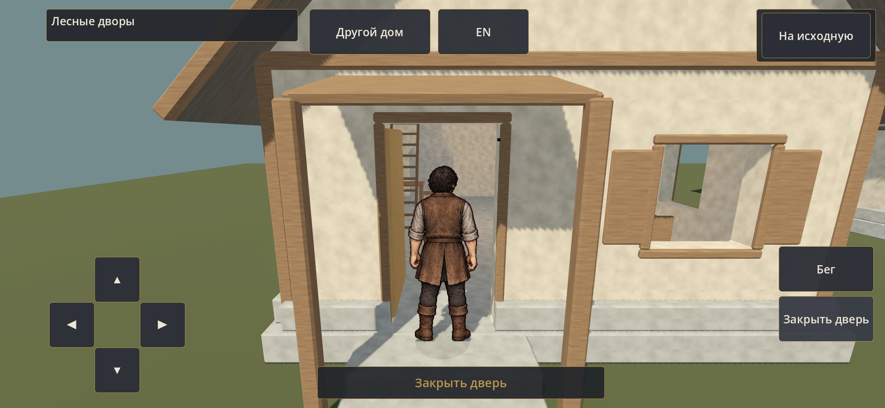
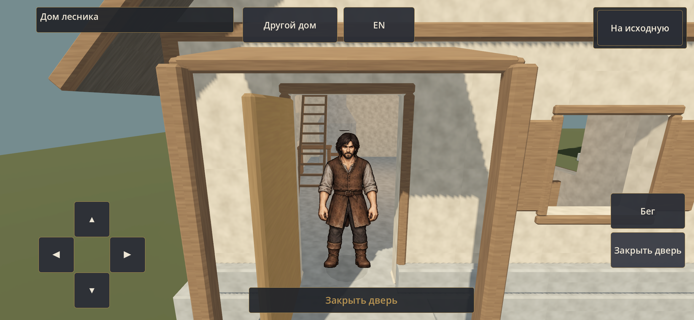
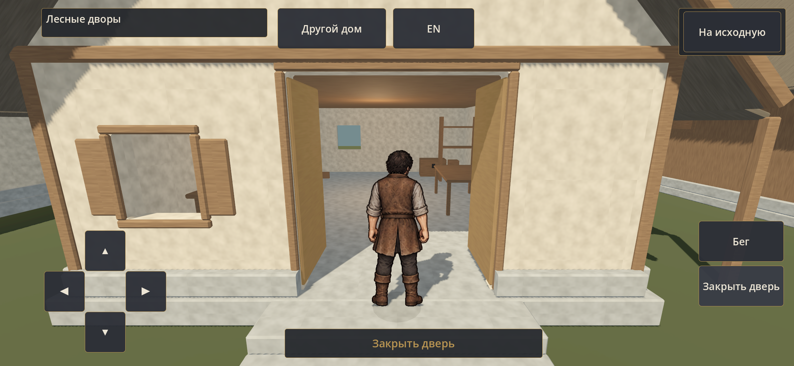

# Двери от героя — 0.22.1/code55

24 сентября 2026. [Протокол и воспроизведение](../../../docs/production/VILLAGE_DOORS_02_CHECKS.md), [результаты](results.json), [исходники SHA256](checked-sources.json), [экспорты](builds.json), [установленная S23 APK](installed-s23.json).

Кадры ниже получены из проверенной обычной APK аппаратными ADB-касаниями. QA-снимки `s23-h01/w01/b01-open.png` и `*-inside-open.png` показывают те же направления для всех трёх дверей; ПК — `pc-w01-open.png`, `pc-h01-outward.png`. Журналы сохранены рядом. Это собственная проверка Codex, не личная приёмка владельца.

[12 секунд действий в обычной APK S23](s23-doors.mp4). `s23-normal-resumed.png` — вход в мастерскую после Home/возврата.
