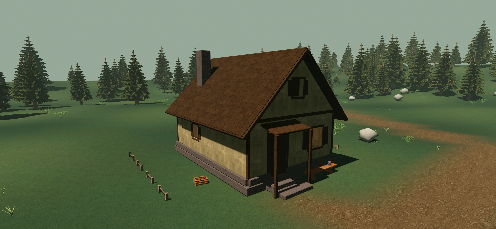

# H01 — принятый вариант А в игре

Forest Village **0.23.5/code61**. [Карточка/проверки](../../../docs/production/VILLAGE_MATERIAL_01_CHECKS.md): ПК/S23 408/408; обычная APK установлена. Выбор концепта А принят D-077; личная оценка этой игровой отделки впереди.

[Старый фасад](s23/exterior-day-before.png) · [под дождём](s23/exterior-rain-after.png) · [ночью](s23/exterior-night-after.png) · [интерьер ночью](s23/interior-night-after.png) · [крыша](s23/roof-day-after.png).

[Автономная галерея до/после](index.html) · [восемь ракурсов ПК](pc/orbit-contact.png) · [прогулка/бег в ливне, обычная APK](s23/normal-weather-motion.mp4).

Материалы: тёплая штукатурка, тёмные балки/дранка, серый камень. [Исходники, CC0 и рецепт](../../../assets/environment/village-house-materials-v1/README.md). Существующие проёмы, двери и мебель сохранены; W01/B01 без новой отделки. Каменный пол H01 — верх прежнего цоколя и получает тот же каменный материал. Свет D-074 и герой прежние.

ПК: WASD/стрелки, Shift — бег, E — дверь. Телефон: сенсорные стрелки, «Бег», кнопка двери. «Время» переключает периоды суток; погода — дождь/ветер/туман/ливень/автоматически, переход 12 с. Окно актуальной сборки: «AshBound — Forest Village 0.23.5».

[Сборки/SHA](builds.json) · [ПК](pc/results.json) · [S23](s23/results.json) · [установка](s23/installed.json) · [исходники QA](checked-sources.json).
