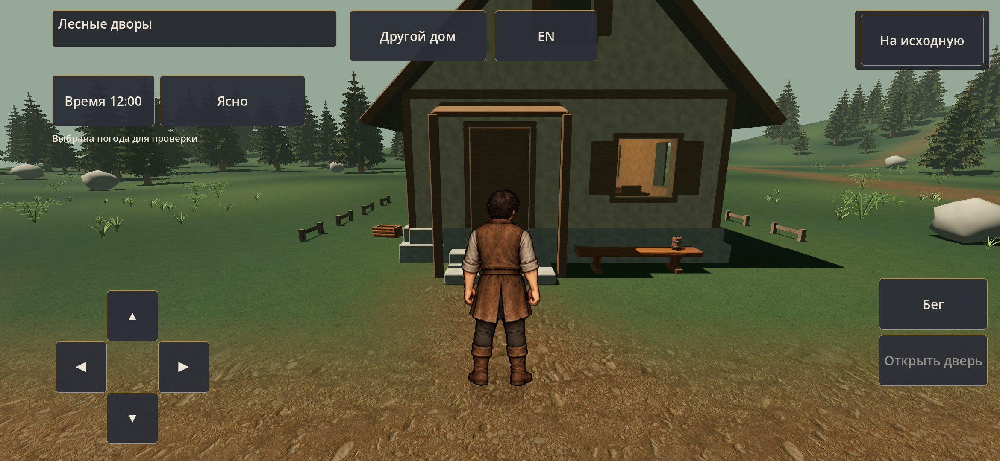
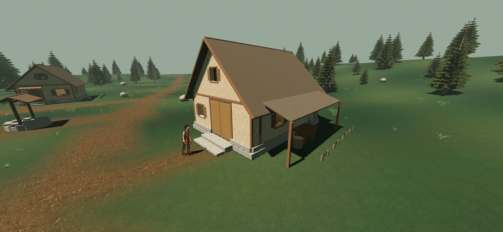
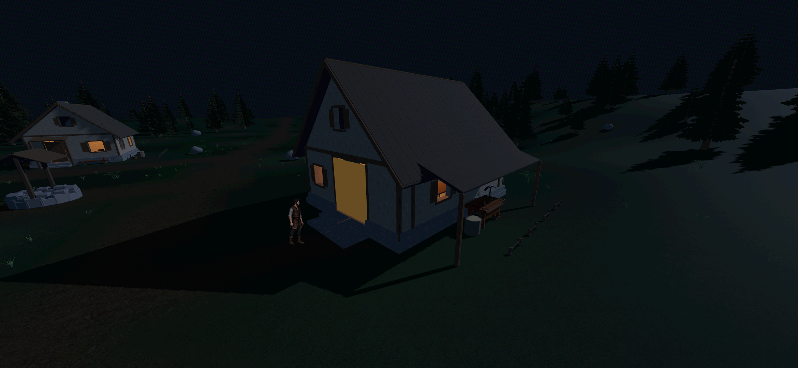
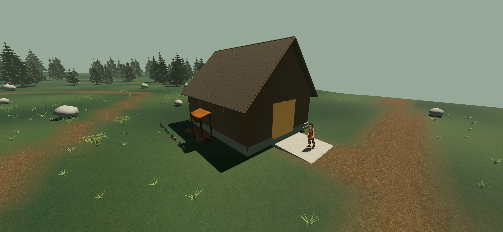

# Лесные дворы — бытовые предметы 0.23.3

Десять бесплатных моделей Quaternius Standard, четырнадцать экземпляров в трёх существующих дворах. [Происхождение и рецепт](../../../assets/environment/village-props-v1/README.md), [фактические проверки](../../../docs/production/VILLAGE_PROPS_01_CHECKS.md), [принятый свет и цвет](../../../docs/art/VILLAGE_LOOK_REFERENCE.md).

Снимки ниже — прямой вывод Godot на S23; изображения не перекрашены. Вид погоды/суток владелец принял по D-074. Новые предметы ещё ждут его личной оценки. Действия с предметами пока отсутствуют.

## Жилой двор

Лавка у окна, кружка на ней, ведро сбоку дома и ящик яблок у стены.

## Мастерская

Рабочий стол под навесом, кружка/верёвка на столешнице, кирка у стены; наковальня в другом боковом дворе.

## Амбар

Тележка с навесом и яблоки на одной стороне, мешки и верёвка на другой. Фронтальный подход остаётся свободным.

Остальные прямые снимки: [ПК](pc), [S23](s23). Небольшое расхождение движения дождевых капель между кадрами ожидаемо. Проверка производительности отражает только короткие записанные маршруты, не длительную тепловую нагрузку.
