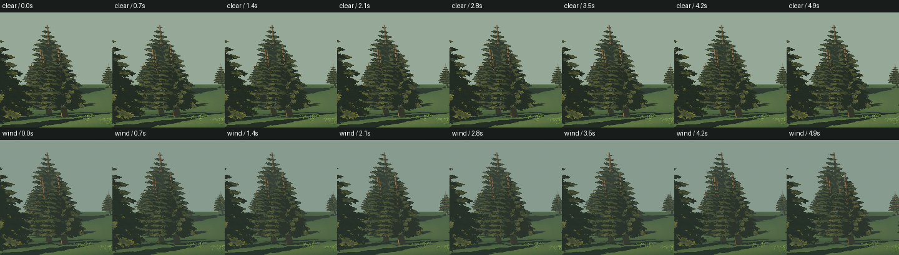
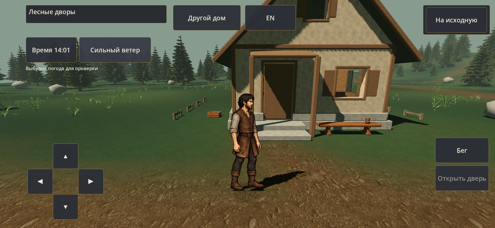

# Ветер деревни — 0.23.4

[Карточка и результаты](../../../docs/production/VILLAGE_WIND_01_CHECKS.md). ПК/S23 439/439. Сильный ветер двигает крону медленнее травы/папоротника; опоры остаются неподвижны. Художественная приёмка владельцем ещё впереди.

## Одна камера, восемь фаз

Сверху ясная погода, снизу ветер. Вырезка из настоящих кадров ПК, 0–4.9 с с шагом 0.7 с; это сравнение фаз, не видео с игровой частотой кадров.

[Полный вид: ясно](pc/clear-0.png) · [ветер](pc/wind-4.png) · [игровая камера S23](s23/game-wind.png)

## На телефоне

[Десять секунд ветра, обычная APK](s23/normal-wind.mp4) · [прогулка/бег в ливне](s23/normal-weather-motion.mp4)

Управление: «Время» переключает периоды суток, кнопка погоды — ясно → дождь → ветер → туман → ливень → автоматический режим. Переход длится 12 секунд. Движение WASD / стрелки или сенсорные кнопки; «Бег» / Shift, двери E / кнопка действия. ПК окно «AshBound — Forest Village 0.23.4».

[Хеши сборок](builds.json) · [установленная обычная APK](s23/installed.json) · [ПК QA](pc/results.json) · [S23 QA](s23/results.json)

В Git оставлены ключевые полные кадры и полоса восьми фаз. Остальные исходные PNG этого прогона сохранены локально в `.tools/wind-raw/`; повторный QA воспроизводит полную серию.
