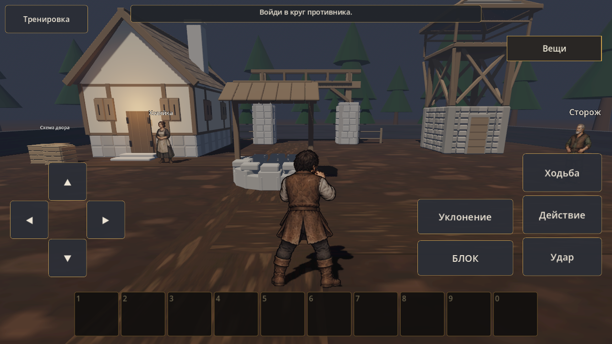
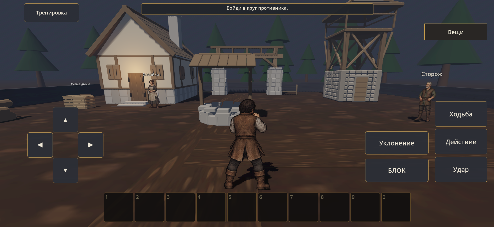
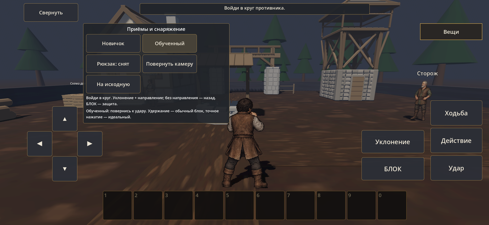
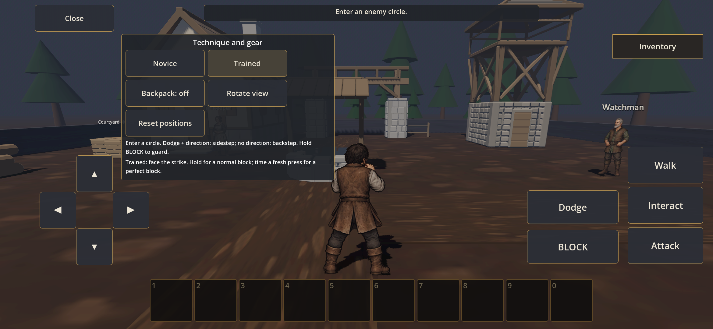

# CONS-02A — освобождённый боевой кадр

23 сентября 2026, 0.18.2-combat-ui. Снимки ниже сохранены в репозитории и не требуют временного веб-сервера. [Протокол и ограничения](../../production/CONS_02A_CHECKS.md).

ПК, исходная сцена и камера, RU, 1280×720: [до, 0.18.1](../cons-01/images/ui-ru-normal.jpg) → [после, 0.18.2](pc-collapsed-ru.png). Механики, персонажи, материалы и свет не менялись; при проверке фиксировалось текущее состояние UI.

Samsung S23, новые нативные кадры 2340×1080; обычная APK установлена и открыта. Панель в раскрытом состоянии не задевает управление движением. Полные инструкции RU/EN внутри; снаружи короткий контекст текущего боя.

[Запись обычной APK, 4 секунды](s23-ui-motion.mp4): движение и позы со свёрнутой панелью. Личный отзыв владельца и полный маршрут CONS-05 отдельно; эта запись их не заменяет.
