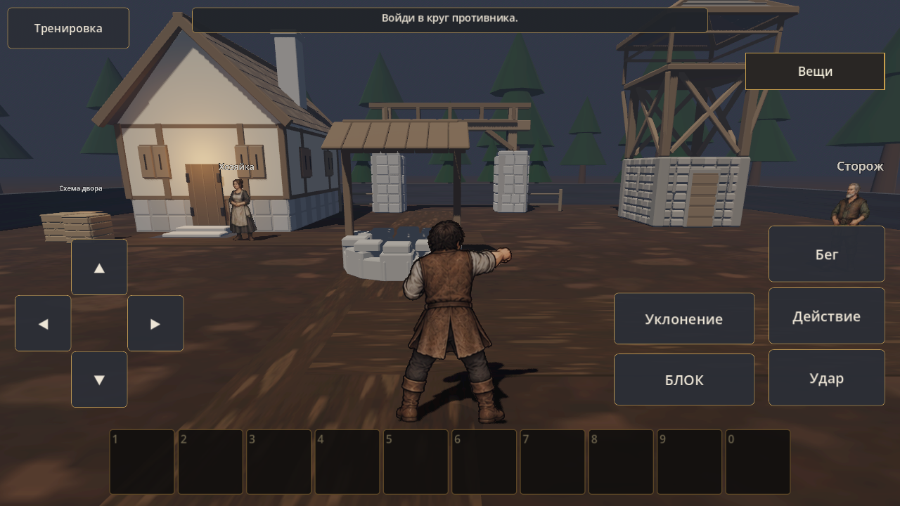
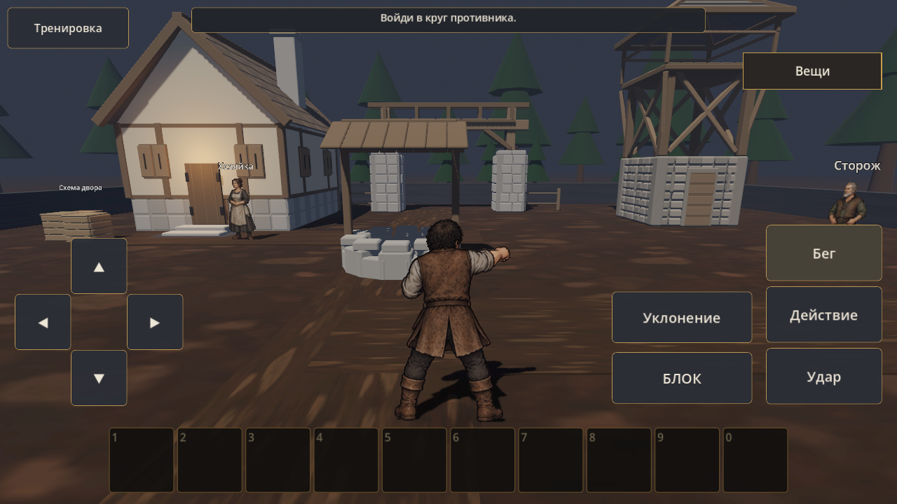
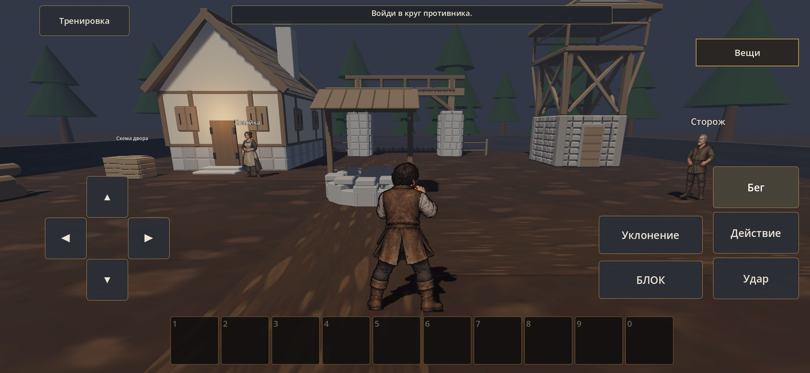
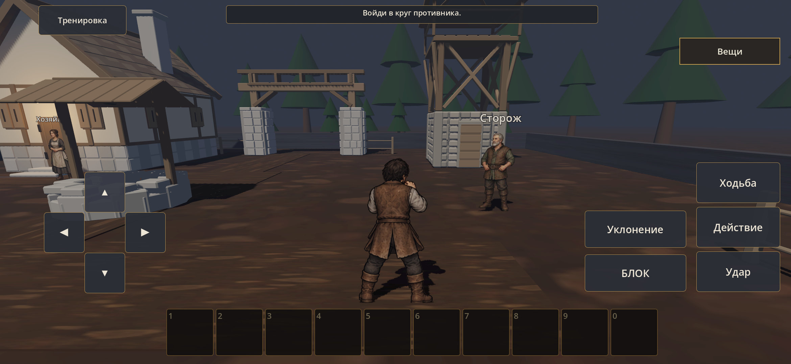

# CONS-02B — состояния HUD

23 сентября 2026. [Проверки и ограничения](../../production/CONS_02B_CHECKS.md). Одна сцена и камера ПК, одинаковые размеры кнопок; сравнивается выделение «Бег». Позы героя в автоматическом сценарии служебные, не эталон новой анимации.

До: режим бега включён, кнопка выглядит обычной.

После: режим бега выделен существующим pressed-стилем HUD.

Обычная APK 0.18.3/code43 на S23, реальное касание кнопки бега:

Возврат из Home после удержания направления: ходьба, движение отпущено.

[8 секунд реального ввода на S23](s23-hud-motion.mp4): переключение бега, удержание направления, отпускание и удар. Полная исходная запись 20 секунд сохранена локально. Нового личного отзыва владельца и проверки OnePlus пока нет.
