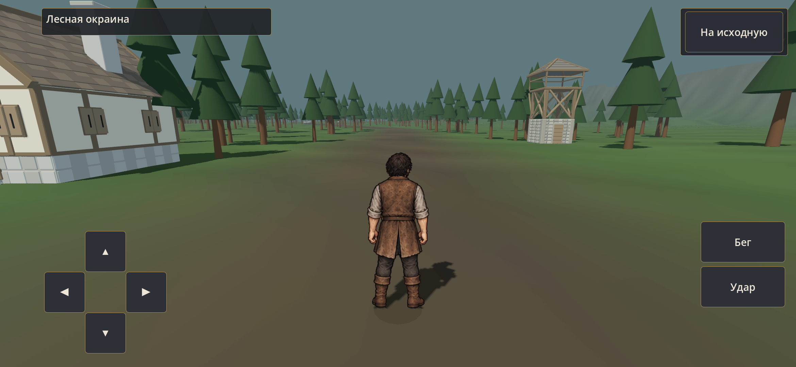
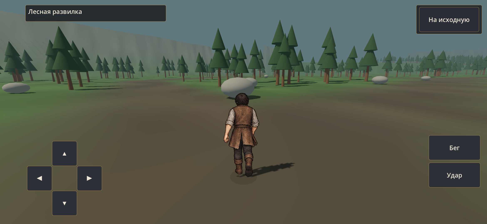
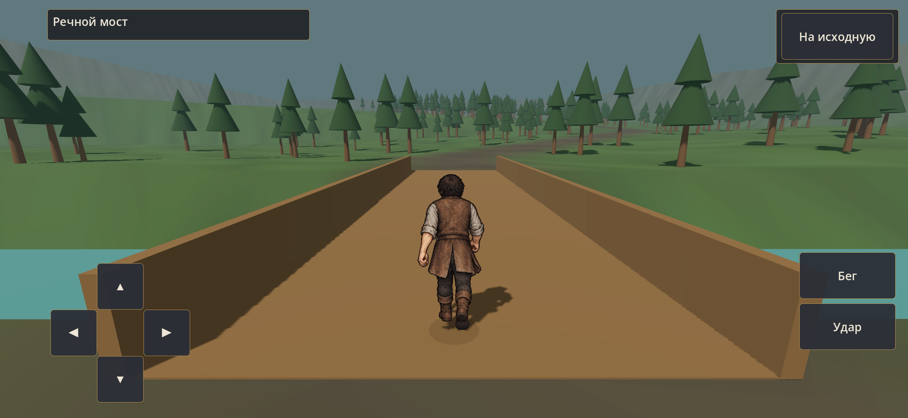
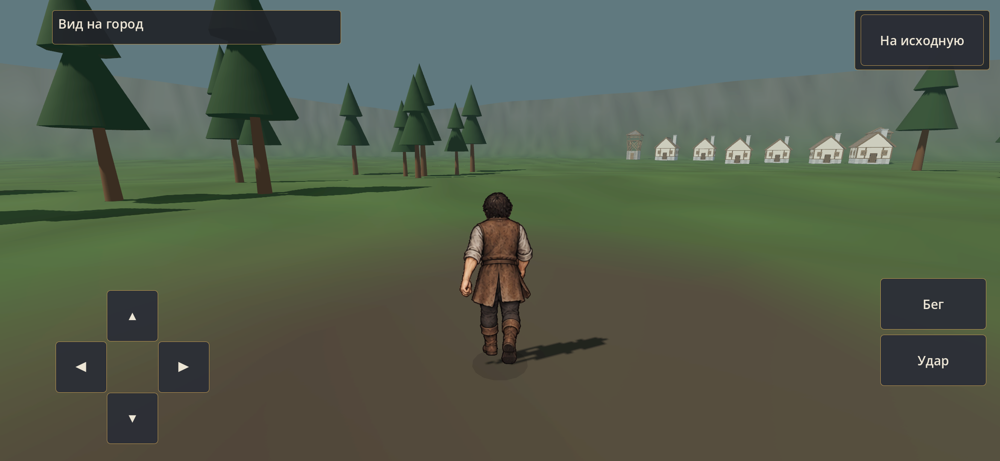

# BIOME-01B — проба лесного маршрута

23 сентября 2026, 0.19.0-forest-route/code45. [Карточка](../../production/BIOME_01B_TASK.md), [проверка](../../production/BIOME_01B_CHECKS.md).

Это объёмный макет масштаба: 633 м основной дороги, боковая петля 192 м вместо прямого участка 79 м. Простая хвоя, мост и десять существующих зданий обозначают ориентиры. Финальные деревья, материалы, вода, город, население и погода здесь не производились; рисованный герой и общая Theme сохранены.

Все снимки ниже — из установленной нативной APK S23, без дорисовки. Движение в QA выполняется настоящим CharacterBody3D через его вектор ввода, без переноса между контрольными точками. Постановка автоматического прохода отдельно от личной проверки владельца.

| Начало | Развилка |
| --- | --- |
|  |  |

| Мост | Вид на город |
| --- | --- |
|  |  |

[20 секунд реального движения на S23](s23-motion.mp4). Запись уменьшена до 1280 пикселей по ширине; полный оригинал локально в `.tools/forest-route-checks/`. Это видео для оценки движения, не отдельный замер FPS.

Codex оценивает здесь непрерывность дороги, различимость развилки/моста/подъёма, масштаб героя и стабильность HUD в движении. Макет читается, но фон и силуэты намеренно условные: сейчас выбираем плотность ориентиров и длину прогулки, а не принимаем художественное качество леса. Следующий результат — художественная проба небольшого участка после оценки маршрута владельцем. Документы и захваты не включаются в APK.
