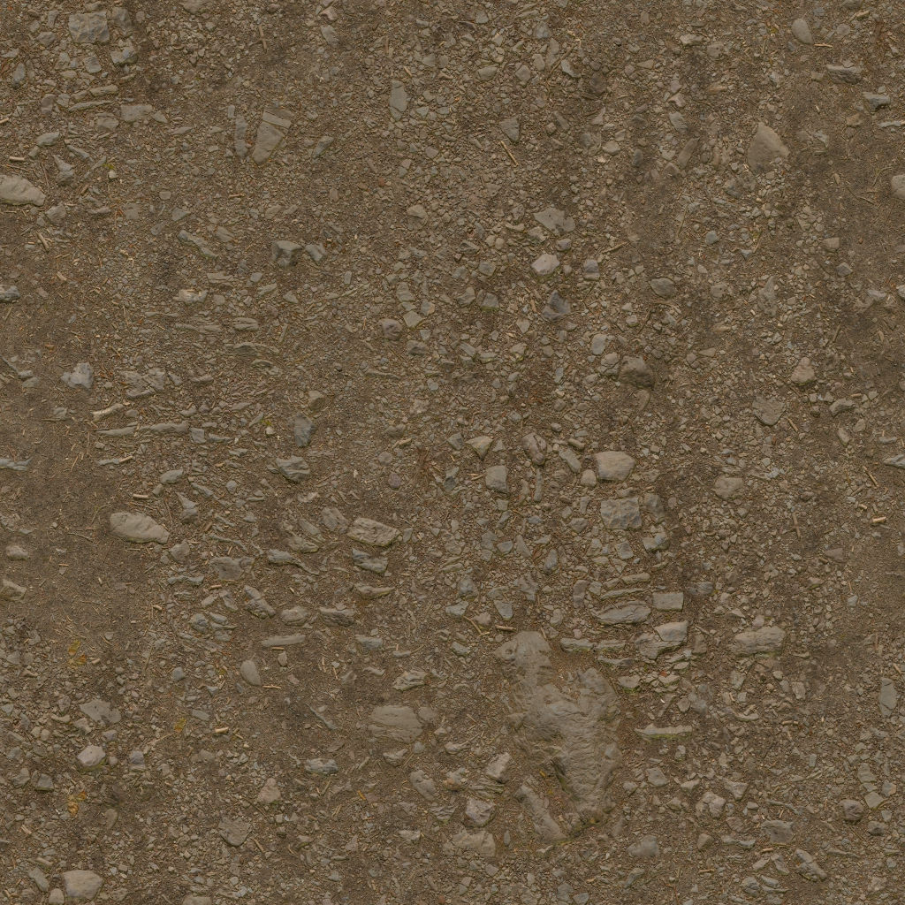
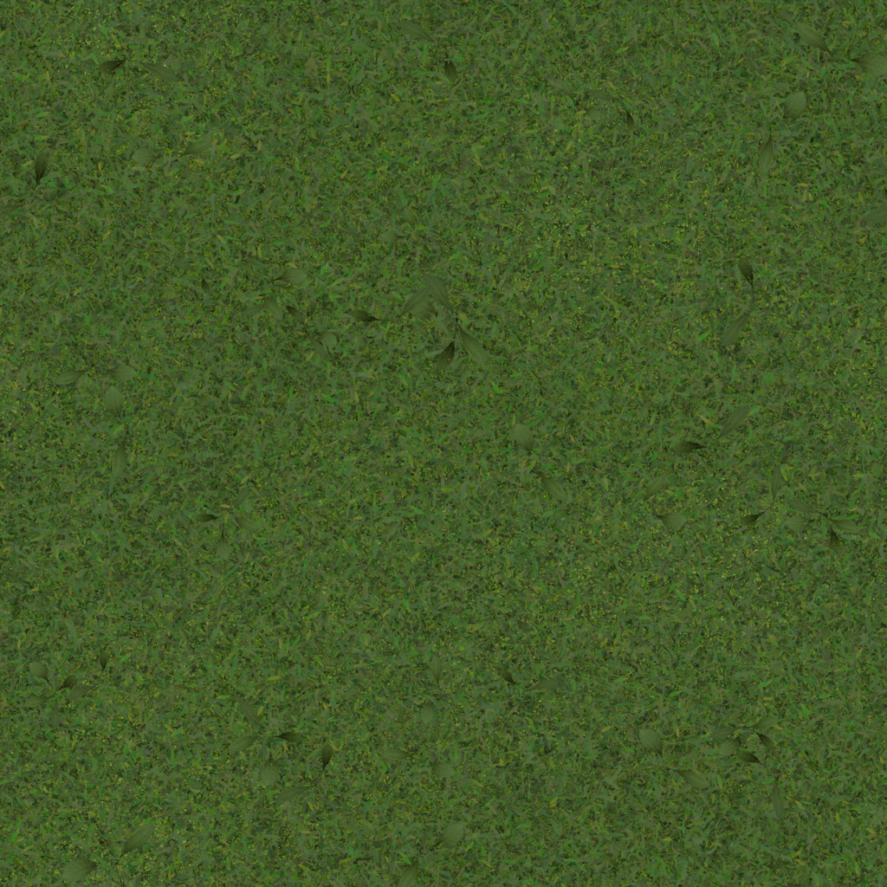
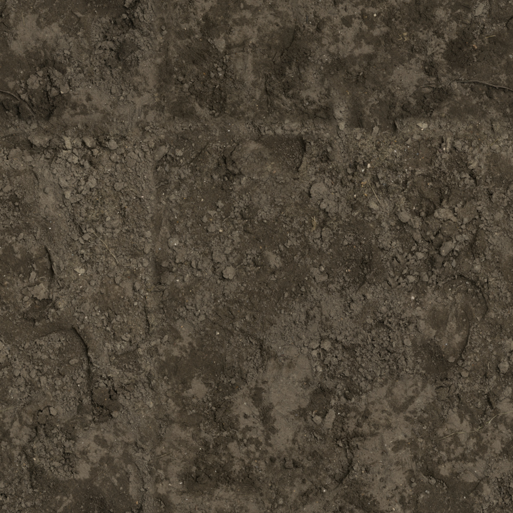

# Бесплатные ассеты для AshBound — выборка 1

24 сентября 2026, D-073. Оценка совместимости — суждение Codex по превью автора и текущей сцене, не художественная приёмка владельцем. [Визуальная выборка](index.html). Все восемь кандидатов имеют бесплатную часть с CC0 по официальным страницам. Проверять именно загружаемую часть, не считать весь рекламный рендер бесплатным комплектом.

В игру подключены Forest Ground 04 и Grass001: [происхождение и SHA](../../../assets/environment/village-surfaces-v1/sources.json), [рецепт](../../../assets/environment/village-surfaces-v1/README.md). По D-074 добавлены десять моделей Fantasy Props Standard: [исходники/лицензия/рецепт](../../../assets/environment/village-props-v1/README.md). Остальные наборы пока не импортированы и не измерены.

## Fantasy Props MegaKit — Standard

[Официальная страница](https://quaternius.itch.io/fantasy-props-megakit) · **CC0 1.0** · Десять моделей в VILLAGE-PROPS-01 / 0.23.3.

В скачанном Standard подтверждены 94 glTF; весь набор — 211. Готовые проекты движков и потёртые варианты относятся к платным версиям.

**Куда:** Жизнь дворов и комнат. **Оценка:** 14 экземпляров в трёх дворах, 25 072 треугольника. Метры/pivot сохранены, шесть простых коллизий, исходные PNG без перекраски и с импортом в 1K. [Проверки и снимки](../../production/VILLAGE_PROPS_01_CHECKS.md).

## Forest Ground 04 — Poly Haven

[Официальная страница](https://polyhaven.com/a/forest_ground_04) · **CC0 1.0** · В сцене 0.23.2.

Полный материал бесплатный; взяты только цвет, normal GL и roughness в 1K.

**Куда:** Каменистая земля и тропы. **Оценка:** Уже проходит проверку в деревне. Тайл 3.2 м. Деталь сведена с текущей палитрой в шейдере; исходные JPG сохранены без редактирования. Без displacement и дополнительных полигонов.

## Grass001 — ambientCG

[Официальная страница](https://ambientcg.com/view?id=Grass001) · **CC0 1.0** · В сцене 0.23.2.

Полный материал бесплатный; 1K Color, NormalGL и Roughness. Автор Lennart Demes.

**Куда:** Почвенный покров полян. **Оценка:** Уже проходит проверку в деревне. Тайл примерно 1.4 м; мелкая фактура под имеющимися объёмными травой и папоротником. При дальнейшей отделке разбить регулярный вид опадом и редкими кустами.

## Medieval Village MegaKit — Standard

[Официальная страница](https://quaternius.itch.io/medieval-village-megakit) · **CC0 1.0** · Для обсуждения будущих домов.

176 бесплатных модулей по листу Standard; 304 — число полного семейства. Standard ZIP доступен бесплатно; Godot-проект и готовые коллизии — Source.

**Куда:** Стены, крыши, лестницы и детали. **Оценка:** Хорошая база деталей; архитектуру согласовывать отдельно. Стены имеют внешнюю и внутреннюю стороны. Взять деревянные/каменные детали; яркую красную черепицу не переносить автоматически. Сохранить размеры проходов и наши двери от игрока.

## Ultimate Stylized Nature — Quaternius

[Официальная страница](https://quaternius.com/packs/ultimatestylizednature.html) · **CC0 1.0** · Отобран, не импортирован.

63 модели, текстуры и normal maps; FBX/OBJ/glTF/Blend.

**Куда:** Разнообразие деревьев и подлеска. **Оценка:** Выборочно после сравнения с нашим лесом. Хороши формы берёз, кусты и текстурированная кора. На авторском рендере слишком светлая сказочная палитра; потребуется наш свет/тон, ветер, простые коллизии и проверка прозрачных крон на телефоне.

## Free CC0 Medieval Props — 3dmodelscc0

[Официальная страница](https://3dmodelscc0.itch.io/free-cc0-medieval-props) · **CC0 public domain** · Кандидат на кружку/мешки.

10 предметов, архив RAR 67 МБ; кружка, кубок, мешок зерна, свиток, ключ и прилавок. Также есть не нужные деревне пушка/эшафот.

**Куда:** Мелкий бытовой реквизит. **Оценка:** Кружка и мешки близки нашему направлению. По превью фактура грубого дерева/металла подходит. Формат отдельных моделей, количество треугольников и размер текстур не проверены: сперва разобрать архив, затем импортировать несколько предметов.

## Brown Mud 02 — Poly Haven

[Официальная страница](https://polyhaven.com/a/brown_mud_02) · **CC0 1.0** · Только выборка.

Весь PBR-материал бесплатный, автор Rob Tuytel.

**Куда:** Мокрые колеи и низины. **Оценка:** Запасной материал. Физический тайл 1.3 м. Для сырой земли у амбара/колодца; сначала маска размещения и сравнение под нашим дождём. Не закрашивать этим всю деревню.

## KayKit Forest Nature Pack — Free

[Официальная страница](https://kaylousberg.itch.io/kaykit-forest) · **CC0** · Резерв, не импортировать целиком.

Free: 100+ моделей. 200+ и восемь цветовых вариантов — Extra, не бесплатная часть; Blend — Source.

**Куда:** Резерв простых форм. **Оценка:** Низкий приоритет для текущего стиля. Очень чистые округлые деревья и градиентные материалы выглядят игрушечными рядом с героем. Может пригодиться геометрия сухостоя/камней после обработки, но замена нашего леса этим набором сейчас не оправдана.

## Источники условий и рабочее правило

- [Poly Haven: лицензия](https://polyhaven.com/license) относится к самим ассетам; авторские рендеры сайта не объявляем своими/CC0. Локальный образец Brown Mud — сам 1K diffuse, скачанный без изменений; автор Rob Tuytel, [прямой файл](https://dl.polyhaven.org/file/ph-assets/Textures/jpg/1k/brown_mud_02/brown_mud_02_diff_1k.jpg).
- [ambientCG: лицензия](https://docs.ambientcg.com/license/). Файлы можно включать и в коммерческий проект. Добровольные кредиты сохраняем.
- [Quaternius: бесплатный Standard на официальных листах](https://quaternius.com/packs/fantasypropsmegakit.html) и [модули зданий](https://quaternius.com/packs/medievalvillagemegakit.html). Проверены листы именно Standard, не Pro/Source.
- [TheBaseMesh](https://www.thebasemesh.com/model-library), [условия CC0](https://www.thebasemesh.com/faq) — дополнительный источник заготовок для Blender. Это библиотека форм, не готовый художественно согласованный комплект; конкретный объект здесь пока не выбран.

Внешние превью в HTML загружаются с сайтов авторов и требуют интернет; описания, скачанные образцы текстур и наши сравнения работают из файлов. Ссылки не означают партнёрства/одобрения игры авторами. Никакие донаты, покупки, аккаунты или подписки не оформлялись.

Для каждого реально взятого файла сохранять автора, прямой источник, лицензию/дату, SHA и преобразования. Применять общий масштаб, материалы и освещение; не смешивать наборы целиком. Перед выпуском — импорт, отсутствие лишних файлов/скриптов, расход памяти и реальные кадры ПК/S23, визуальное сравнение с героем. По D-073 явно подходящие ассеты можно использовать с отчётом после; смена планировки/направления остаётся отдельным решением.
