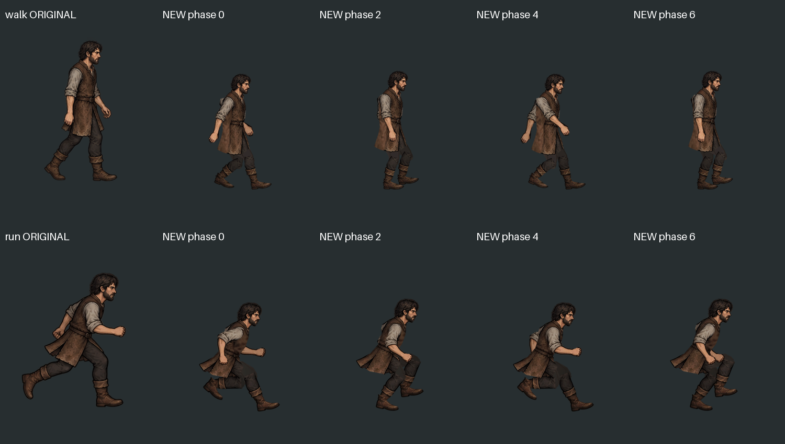
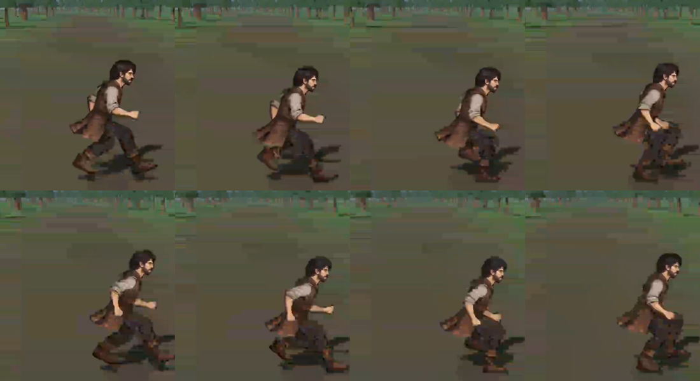
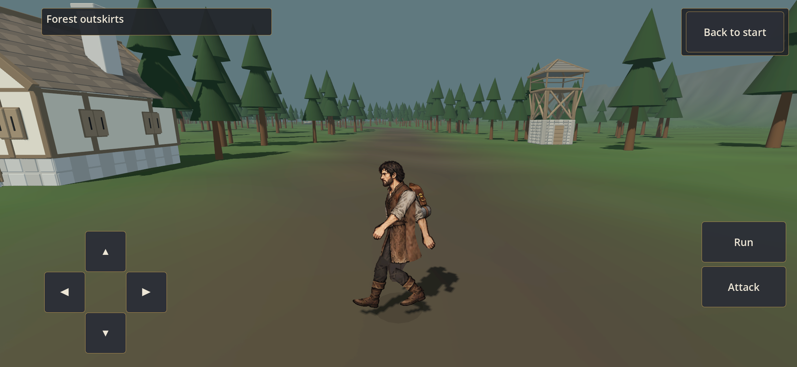
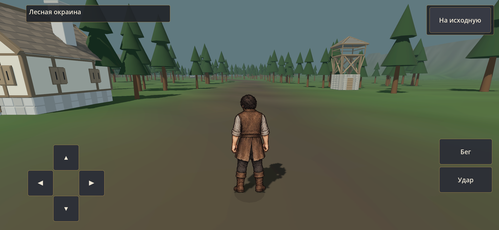

# Боковой цикл — сравнение SIDE-GAIT-02

23 сентября 2026, Forest Route 0.19.2/code47. [Производственные исходники](../../../art/characters/side-gait-v1/README.md), [автономный просмотр с замедлением](../../../art/characters/side-gait-v1/preview/index.html), [проверки и ограничения](../../production/SIDE_GAIT_02_CHECKS.md).

Исходная поза и новые контакт/проход/противоположный контакт/возврат. Размеры изображений на странице предназначены для сравнения рисунка; игровые масштаб и опора проверены отдельно.

[12 секунд движения на S23](s23-gait.mp4) — реальная запись QA, не синтетический ролик. Ниже последовательные кадры из неё; компрессия записи не является изменением игровых PNG.

Одна фиксированная поза с рюкзаком в реальной сцене:

Обычная установленная APK после проверки касаний и возврата на старт:

Результаты: [арт](art-checks.json), [ПК](side-gait-results.json), [интерполяция ПК](interpolation-results.json), [native S23](s23-gait-results.json), [обычная APK](s23-release.json). Личная художественная оценка владельца ещё не получена.
