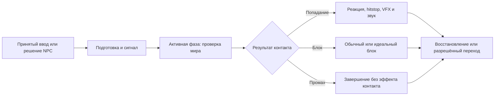

# Frame data и выразительность боя AshBound

**Текущее уточнение 22 сентября — 0.18.0:** [один удар стражника](../production/GUARD_ATTACK_PHASES_CHECKS.md) уже имеет ресурс времени и активный интервал 48/6/36; проверки ПК/S23 пройдены. [Рисованные эффекты](../production/PAINTED_COMBAT_CHECKS.md) и [палитра блока](../production/GUARD_PALETTE_CHECKS.md) также выполнены. Волк и герой сохраняют прежние атаки; общего буфера/комбо нет. Ниже сохранено исходное исследование и история проб, а не утверждение готовности всей боевой системы.

Исследование от 22 сентября 2026 года. Первоначальная версия была только документом для обсуждения. После поручения владельца выполнена [проба 0.17.1](../production/COMBAT_FEEDBACK_CHECKS.md): пространственные эффекты и локальный hitstop на существующих атаках, с проверкой ПК/S23. На момент исследования таблица атак, активные интервалы и общий буфер ещё не были реализованы; ниже сохранены определения и предложения исследования.

Владелец положительно оценил пробу волка и стражника 0.17.0, попросил обсудить пространственные эффекты входящей атаки/блока, hitstop и изучить Fighting Game Frame Data System. Это подтверждает интерес к направлению, но не утверждает предложенные ниже числа, комбо, правила оглушения или окончательный художественный стиль. Ошибка светлой палитры обученного в блоке впоследствии исправлена в 0.17.4.

Связанные требования: [мастерство и защита](COMBAT_MASTERY.md), [3D-мир и рисованные персонажи](../art/VISUAL_DIRECTION.md), [цельные кадры экипировки](../art/CHARACTER_VARIANTS.md), [текущая проба врагов](../production/CORNER_ENEMIES_CHECKS.md).

## 1. Источники и степень проверки

Материал ниже разделён на определения из источников, наблюдения по текущему коду и предложения Codex для AshBound. Пересказ чужого видео не используется как доказательство устройства его системы.

| Источник | Что проверено и для чего сохранён |
| --- | --- |
| [Inbound Shovel — I made a Fighting Game Frame Data System for my Indie Game!](https://www.youtube.com/watch?v=Dptztdm1rtg) | Ссылка владельца. Прочитаны название, описание автора и страница YouTube: система атак для Isadora's Edge на Godot, ролик около 31:42. Полную расшифровку получить не удалось: экспорт сообщил об отсутствии текста, endpoint субтитров вернул пустой ответ. Подробный алгоритм автора не объявляется изученным или перенесённым. |
| [Video Game Animation Study — Keyframes in Fighting Games](https://www.youtube.com/shorts/f0hOjW3uAJw) | Ссылка владельца. Проверены автор, название, описание и отдельные визуальные кадры; около 55 секунд. Описание ведёт к [How 2D Fighter Games are Animated](https://www.youtube.com/watch?v=WYCjmVhiLaM). Полная расшифровка недоступна; это сохранённый художественный референс, а не основание для приписывания автору конкретных технических правил. |
| [Infil — The Fighting Game Glossary](https://glossary.infil.net/?t=Frame%20Data) | Первичный авторский справочник. Определения прочитаны в публичных [данных самого сайта](https://glossary.infil.net/json/glossary.json), поскольку текст статей подгружается JavaScript. Использованы статьи Startup, Active, Recovery, Frame Advantage, Hitstop, Blockstop, Hit Stun, Block Stun, Hitbox, Hurtbox, Buffer Window, Cancel, Link. |
| [r/Fighters — Explain frame data to me in the most simplest way you can](https://www.reddit.com/r/Fighters/comments/10uj4ej/explain_frame_data_to_me_in_the_most_simplest_way/) | Дополнительная ссылка владельца, обсуждение прочитано. Полезно как пример объяснения игроку: когда можно ответить после блока и зачем знать свойства знакомого удара. Упрощения проверяются по справочнику; комментарии не задают контракт AshBound. |
| [Godot — Idle and Physics Processing](https://docs.godotengine.org/en/stable/tutorials/scripting/idle_and_physics_processing.html) | Официальное различие обновления изображения и физики. Физический шаг по умолчанию 60 Гц; частота отрисовки может отличаться. |
| [Godot — Engine](https://docs.godotengine.org/en/stable/classes/class_engine.html) | Официальные свойства частоты физики, ограничения догоняющих шагов и масштаба времени. Ограничение числа шагов означает, что при перегрузке использование delta само по себе не гарантирует ход игры в реальном времени. |
| [PlayStation — разработчики о бое God of War 2018](https://blog.playstation.com/2022/10/04/game-developers-explain-what-makes-god-of-war-2018s-combat-tick/) | Прочитан разбор: контакт подчёркивают удержание атакующего и цели в позах удара, звук и реакции. Предупреждения об атаках обсуждаются отдельно от эффекта попадания. |

Названия видео и описания не заменяют просмотр всей демонстрации. Нет подтверждённых таймкодов технических выводов по двум присланным роликам. Полные тексты чужих материалов и ассеты в Git не копируются.

## 2. Короткий словарь

Frame data описывает временные свойства действия. «Кадр» здесь — единица времени выбранной боевой системы; картинка спрайта и кадр дисплея могут иметь другой ритм. Определения ниже кратко пересказаны по [Infil](https://glossary.infil.net/?t=Frame%20Data).

| Термин | Значение |
| --- | --- |
| Startup | Подготовка до возможности попасть. |
| Active | Интервал, когда атака способна задеть цель. |
| Recovery | Завершение атаки до восстановления доступных действий. |
| Hitstun / blockstun | Ограничение действий получившего удар / заблокировавшего. |
| Hitstop / blockstop | Краткая остановка при попадании / блоке, отдельная от обычных фаз. |
| Frame advantage | Кто раньше восстановил возможность действовать после контакта. |
| Hitbox / hurtbox | Область атаки / область тела, принимающая попадание. |
| Input buffer | Короткое хранение раннего ввода до допустимого начала действия. |
| Cancel | Разрешённое прерывание действия переходом в другое. |
| Link | Следующая атака после полного завершения предыдущей. |

В таблицах разных игр startup считают неодинаково: часто первый активный кадр включён в число startup. Поэтому перед переносом чисел нужно проверить соглашение о границах. [Определение Startup](https://glossary.infil.net/?t=Startup).

В Reddit полезна мысль «выучить подходящий ответ на знакомый удар, а не всю таблицу». Для нашего обучения это предложение: показать ситуацию, дать повторить блок/уход/ответ и объяснить результат. Аналогия с очередью действий помогает, но не делает бой пошаговым. [Обсуждение владельца](https://www.reddit.com/r/Fighters/comments/10uj4ej/explain_frame_data_to_me_in_the_most_simplest_way/).

## 3. Пример расчёта для обсуждения

Это придуманный пример Codex, **не текущие параметры героя, волка или стражника**. Возьмём условные 60 боевых шагов в секунду: один шаг — около 16,67 мс. Нумерация начинается с нуля, интервалы включают начало и исключают конец.

| Время атаки | Состояние |
| --- | --- |
| [0, 12) | Подготовка: 12 шагов, 200 мс |
| [12, 16) | Активная фаза: 4 шага, около 66,67 мс |
| [16, 34) | Восстановление: 18 шагов, 300 мс |
| 34 | Атакующий снова может действовать |

При контакте в момент 12 и условном blockstun 16 шагов защищавшийся готов в момент 28. Разница `28 − 34 = −6`: атакующий восстанавливается позже на 6 шагов, около 100 мс. При контакте в момент 15 защищавшийся готов в 31, преимущество атакующего уже `31 − 34 = −3`.

Удобная проверочная формула: **преимущество атакующего = момент готовности защитника − момент готовности атакующего**, на одной шкале времени. Так учитывается и поздний контакт в активной фазе. Связь с общим определением: [Frame Advantage](https://glossary.infil.net/?t=Frame%20Advantage).

Наш вывод для 3D-пробы: возможность наказать удар проверяется ещё дальностью, направлением, препятствием, моментом ввода и разрешёнными переходами. Отрицательное преимущество само по себе не гарантирует попадание ответом. На точном равенстве времён нужен явный порядок обработки; обещать «успевает ровно N-кадровый удар» до этой проверки нельзя.

Если обоим участникам добавить одинаковую остановку и затем продолжить их прежние фазы, обе даты готовности сдвинутся одинаково. Если останавливать их по-разному или дать одному отмену, баланс изменится. Это вывод из формулы, а не правило всех файтингов.

## 4. Что уже есть в AshBound 0.17.0

Проверено чтением кода от `dev` **31830f2449dffa862deab6488c279ad94932e669**, без запуска новой игровой проверки:

| Нынешнее поведение | Где смотреть |
| --- | --- |
| Волк: замах 0,70 с; стражник: 0,80 с; восстановление обоих 0,70 с | [corner_enemy_actor.gd](../../scripts/tools/corner_enemy_actor.gd), `setup()` |
| Последние 0,18 с замаха — сигнал блока; волк в это время делает выпад | Тот же файл, `is_block_window_open()` и `_step_windup()` |
| Одна проверка контакта в конце замаха, защищённая `_contact_done` | `_step_windup()`; это ещё не непрерывный активный интервал hitbox |
| Контакт учитывает дальность, высоту, сектор, препятствие, технику и направление блока | [corner_enemy_session.gd](../../scripts/tools/corner_enemy_session.gd), `_resolve_contact()` |
| Попадание героя переводит врага в stagger на 0,45 с; идеальный блок — на 0,65 с | `receive_hit()` и `_step_windup()` актора |
| Сессия делит переданное время на шаги до 1/60 с, общий delta ограничен 0,25 с | `advance()` сессии; это не доказательство полной детерминированности физики |
| Камера меняет ракурс рисунка с сохранением текущей фазы | [courtyard_character_visual.gd](../../scripts/courtyard/courtyard_character_visual.gd), `update_visual()` |

Нынешний stagger не является hitstop. Общая система ресурсов frame data, измеритель преимущества, новые активные объёмы и предлагаемый набор VFX ещё не реализованы. Исторические результаты тестов этой сборки находятся в [протоколе врагов](../production/CORNER_ENEMIES_CHECKS.md); данное исследование их не повторяет и не расширяет.

## 5. Предложение: одна временная схема действия

Для будущей реализации предлагаем описывать атаку в одном месте: фазы, движение, боевой объём, смены ключевых поз, предупреждение, разрешённые переходы и события звука/VFX. Оттуда получать и исполнение, и отладочную временную шкалу. Изменение длительности не должно оставлять старый момент попадания в другом скрипте.

Диаграмма — предложение структуры, не точная схема нынешних классов. Формат данных выбирается отдельной ограниченной задачей с исполнителем по D-047; полноценный редактор атак сразу не требуется.

Для первой записи достаточно ID атаки/техники, длительностей фаз, правил движения и поворота, геометрии контакта, списка поз по времени, вариантов результата и правил отмены. Каждый запуск получает собственный ID; один разрешённый контакт не повторяется из-за удержания позы, hitstop или поворота камеры. Многоударность впоследствии описывается явно, а не получается случайно от нескольких физических шагов.

Боевые объёмы располагаются в мировых координатах относительно игрового направления персонажа. Они не поворачиваются вслед за плоскостью спрайта к камере. Для быстрого выпада нужно отдельно проверить пересечение пути между положениями: редкие проверки только в конечных точках могут пропустить цель. Это требование будущей пробы, не готовая функция.

## 6. Разделение времени и ввода

Предлагаем три независимых понятия: шаг боевой симуляции, расписание рисованных поз и частоту отображения. 60 Гц симуляции — удобная исходная гипотеза; ориентир 15 поз/с остаётся художественным. Экран 30/60/120 Гц не должен менять номинальные длительности действий. Основание для разделения — [официальная документация Godot](https://docs.godotengine.org/en/stable/tutorials/scripting/idle_and_physics_processing.html).

У текущего окна 0,18 с получается 10,8 условного шага 60 Гц. Молча округлить это в новую длительность нельзя. При переходе к целым тикам нужны отдельное решение о границах, запись фактической длительности и повторная проверка раннего/точного/позднего ввода. До такой миграции исходные секунды остаются источником истины, frame-эквивалент только справочный.

Предложение по hitstop: сначала кратко останавливать фазу и намеренное перемещение участников контакта. Камера, интерфейс, чтение касаний и эффекты продолжают обновляться. Не менять глобальный ход суток или меню ради локального удара. Это не означает простое отключение всей физики персонажа: опора, коллизии и последующее продолжение должны оставаться корректными.

Для одновременной атаки двух врагов требуется отдельное правило: кто входит в остановку, когда второй контакт считается и какие возможности остаются у героя. Локальная остановка одной пары при работающем втором враге способна изменить баланс; не объявлять этот случай решённым автоматически. Повторные события не должны бесконечно продлевать заморозку.

Буфер ввода — возможная следующая проба для отзывчивости телефона. Начать с одного ожидающего действия и ограниченного срока. Раннее нажатие атаки может ждать допустимой фазы; удержание блока не превращается в новое нажатие. Для идеального блока сохраняется настоящий момент press: выполнение буфера позже не должно выдавать его за свежее точное нажатие. Во время hitstop отдельно согласуются временная отметка ввода и остановленное время атаки.

Меню, потеря фокуса, Android Home, сброс сцены и смена режима очищают незавершённые действия. По возвращении нельзя воспроизводить старый удар, VFX или «залипший» блок. Уже разрешённый контакт не пересчитывается повторно.

## 7. Как добиться выразительности при небольшом числе рисунков

Ниже — художественное предложение Codex для AshBound, не пересказ недоступной расшифровки Shorts.

Каждому удару нужны узнаваемая исходная поза, подготовка с переносом веса, резкая поза контакта и завершение с возвращением равновесия. Длительность удержания поз может различаться: выразительный ритм важнее одинакового времени каждой картинки. Принудительное равномерное проигрывание всех рисунков по 15/с не является целью.

В момент подтверждённого попадания атакующий должен показывать контакт, получивший удар — реакцию. Hitstop, растягивающий случайный кадр замаха, будет выглядеть задержкой. Короткий нарисованный след движения может связать редкие позы; ширина тела, лицо, палитра и опора ног между ними сохраняются. Новичок и обученный по-прежнему различаются техникой, а не только скоростью одного клипа.

| Событие | Предлагаемое изображение в мире |
| --- | --- |
| Подготовка стражника | Работа плеча и кулака; небольшой направленный акцент у атакующей руки |
| Подготовка волка | Сжатая поза перед броском; сигнал окна рядом с головой/плечами |
| Окно точного блока | Краткое изменение формы и яркости сигнала перед контактом |
| Попадание | Компактный рисованный всплеск у места соприкосновения, реакция тела, звук |
| Обычный блок | Плотный короткий акцент у предплечий, заметная отдача и глухой звук |
| Идеальный блок | Более резкий светлый акцент и короткая расходящаяся дуга, различимый отвод атаки |
| Промах | След движения допустим; всплеск контакта и hitstop отсутствуют |

Сигнал до удара и подтверждение после него отличаются формой и ритмом, а не одним цветом. 3D-размещение означает реальную точку и направление эффекта в мире; рисунок может оставаться стилизованным. Проверять глубину, перекрытие героем со спины и вид сбоку. Вращение камеры не переносит контакт на другую сторону тела и не скрывает обязательный сигнал целиком.

Пыль и воздух подходят кулакам и укусу; металлические искры можно оставить будущему оружию. Эффекты не должны закрывать замах следующего врага. Яркость отдельного всплеска не оправдывает постоянное осветление текстуры персонажа. Сильная тряска и полноэкранные вспышки не включаются по умолчанию в предложение.

Референс ощущения контакта — описанная разработчиками связка поз, звука и короткого удержания в [разборе God of War](https://blog.playstation.com/2022/10/04/game-developers-explain-what-makes-god-of-war-2018s-combat-tick/). Конкретные длительности для AshBound оттуда не заимствуются.

## 8. Числа только для сравнения в будущей пробе

| Параметр | Предложение Codex | Статус |
| --- | --- | --- |
| Hitstop обычного попадания | Сравнить 0, 40–60 мс | В пробе 0.17.1 реализовано 50 мс; окончательная оценка впереди |
| Акцент идеального блока | Сравнить 70–90 мс с обычным попаданием | В пробе 0.17.1 реализовано 5/60 с; обычный блок 2/60 с |
| Буфер атаки | Возможная отдельная проба 80–120 мс | Не вводить вместе с VFX без самостоятельной проверки |
| Сигнал/окно точного блока | Сохранить нынешние 0,18 с до отдельного решения | Экспериментальное текущее значение |

При фиксированных тиках показывать реально достижимые величины: например, 3/60 с = 50 мс, 5/60 с ≈ 83,33 мс. Не выдавать число из диапазона за точное исполненное время. Сравнение на телефоне обязательно: при редкой смене поз короткая остановка может теряться, а слишком долгая — ощущаться зависанием.

## 9. Ограниченные следующие шаги

Первый шаг обратной связи теперь проверен в 0.17.1; остальные пункты сохраняются как отдельные предложения:

1. Владелец поручил реализовать пробу. Ошибка светлого блока остаётся отдельной правкой.
2. Проба на существующих врагах выполнена: эффект входящей атаки, различимые hit/block/perfect и короткий hitstop. Нынешние дальности, одиночный контакт и окно блока сохранены. Ручная оценка ощущений владельцем ещё требуется.
3. Отдельно описать одну атаку данными и добавить служебную шкалу фаз, принятых нажатий и контактов. На первом переносе сравнить поведение с исходной атакой.
4. Отдельно исследовать активный интервал, входной буфер и разрешённые переходы. Их влияние на сложность не прятать в художественной правке.
5. После проверки распространить подход на остальные атаки и продолжить уклонение по COMBAT-02.

Frame advantage, hitstun и blockstun нужны для проектирования, но это не разрешение сразу вводить длинные комбо, бесконечное оглушение или дополнительные полосы ресурсов. Исходное направление — RPG с камерой за спиной, а не перенос правил конкретного соревновательного файтинга целиком.

## 10. Приёмка будущей реализации

Основные проверки проектирует и выполняет Codex; игровая реализация и исправления распределяются по сложности согласно [D-047](../../AGENTS.md). Каждая ограниченная задача — новая ветка от актуального dev с PR. Предлагаемые сценарии:

- На границах startup/active/recovery: контакт до, в начале, в конце и после активного интервала; отдельно точное равенство времени ввода/контакта.
- Один запуск → допустимое число контактов, один набор VFX/звука; удержание кадра, поворот камеры и возобновление после остановки не дублируют результат.
- Ранний/точный/поздний блок, длительное удержание, отпускание вне кнопки, частые нажатия; буфер и hitstop не расширяют идеальное окно скрыто.
- Дальность, угол, высота, стена, движение цели и пересечение траектории выпада между шагами; видимая линия удара соответствует проверке мира.
- Сравнение временных журналов при 15/30/60/120 FPS отрисовки, разных ритмах поз и искусственных задержках. Перегрузку физики проверять отдельно от обычной смены FPS.
- Одновременные контакты волка и стражника, повторное попадание во время hitstop, очистка при меню/Home/фокусе/reset; нет вечной остановки или старого действия после возврата.
- Все ракурсы, новичок/обученный и ±рюкзак: одинаковые фазы и палитра, читаемые силуэт/опора, эффект не скрывает защиту и сенсорные кнопки.
- Текущие регрессии врагов, защиты, UI, локализации и сохранений; код выхода, ожидаемые маркеры и отсутствие ошибок Godot проверяются вместе.
- Актуальная APK установлена и сверена на целевом телефоне до просьбы о личной проверке. Раздельно записать результат S23 и OnePlus; не переносить успешность одного устройства на другое.

Для служебного журнала полезны ID действия, фактические времена press/начала/контакта/готовности, результат, длительность остановки и число повторных событий. Это отладочная информация; таблица frame data не добавляется в обычный игровой HUD.

## 11. Проверка данного документа

Первоначальное исследование касалось только Markdown: проверены ссылки, обе видеоссылки и Reddit, формулы примера, отделение фактов от предложений и согласованность с памятью/планом. Последующая игровая реализация и проверка телефона описаны отдельно в протоколе 0.17.1 выше; они не означают реализации всех предложений этого документа.
