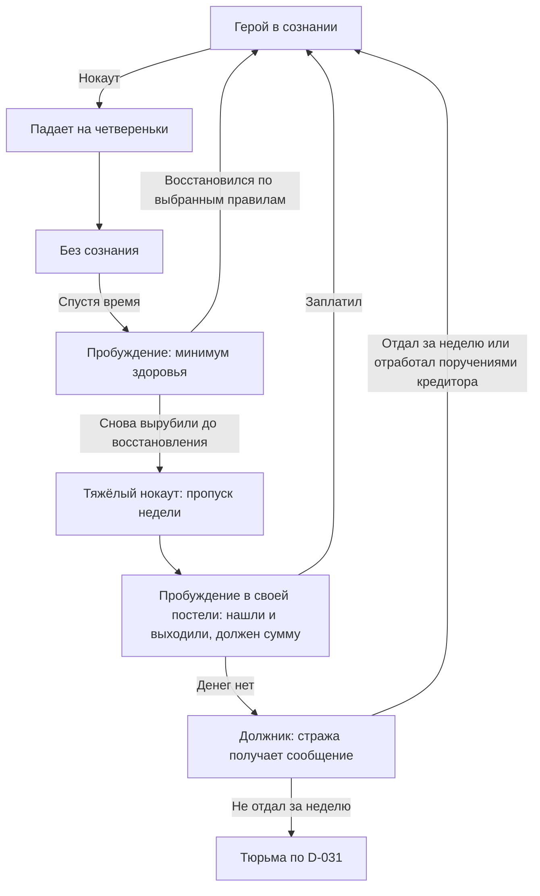

# Инвентарь без рюкзака и второй шанс

23 сентября 2026. Прямые решения владельца **D-057/058**. Это план, не функции текущей сборки. [Очередь](../production/STATUS.md), [roadmap](../production/ROADMAP.md), [карточка обновления](../production/INVENTORY_SECOND_CHANCE_PLAN_TASK.md).

## Что подтверждено

**D-057 — убрать рюкзак.** Рюкзак исключается из целевой системы экипировки, хранения и производства спрайтов. Для новых действий и комплектов брони не нужны варианты ±рюкзак. Существующие ресурсы/старые сборки сохраняются до отдельной безопасной миграции; запись решения сама по себе не удаляет вещи из сохранений.

Основной инвентарь доступен со старта, открывается после существующего заглядывания за пазуху и изначально больше прежнего кармана. Его вместимость немного увеличивается с каждым уровнем героя и дополнительно увеличивается с каждой прокачкой силы. Покупать или надевать сумку для доступа к нему не требуется. Цельный сет одежды и оружие сохраняют свои слоты; разделы карты, заданий, персонажа и настроек, десять быстрых назначений и требование физической карты сохраняются.

Остаётся отдельная **секция кошелька для реально помещённых туда мелочей**. Это целевой раздел инвентаря, без требования надевать отдельный мешочек. Его содержимое не конфискуют при аресте и не забирают при ограблении героя в обмороке. Защита относится к фактическому месту предмета, а не к его названию или одной лишь принадлежности герою. Кошелёк не делает весь основной инвентарь защищённым; какие именно мелкие предметы допустимы и сколько их помещается, ещё предстоит выбрать.

**D-058 — второй шанс после первого нокаута.** При соответствующем поражении герой падает на четвереньки и теряет сознание. Через некоторое время он приходит в себя в игровом мире с минимальным здоровьем и получает возможность восстановиться. Если вскоре снова ввяжется в бой и будет повторно нокаутирован, наступает смерть. Обморок, пробуждение и смерть должны быть различимыми состояниями, а не одним мгновенным перезапуском.

**D-093, 25 сентября — без мгновенной смерти.** Для телефона внезапная смерть лишняя. Повторный нокаут до восстановления ведёт не к смерти, а к тяжёлому нокауту с долгом:

Постель берётся актуальная: своя койка в трактире (после D-092) или свой дом. Открыто:
- где просыпается герой без своей постели;
- сумма долга и её зависимость от лечения;
- кто кредитор — знахарь, трактирщик или спаситель;
- какие поручения идут в зачёт отработки;
- что происходит с вещами за пропущенную неделю.

Схема фиксирует идею; точные условия возврата в обычное состояние и длительность опасного периода открыты. Прежние правила лечения причин ран и полного восстановления только полноценным отдыхом сохраняются. Пробуждение с минимумом здоровья не означает автоматического исцеления всех травм. Отсутствие постоянных полос здоровья/маны и обучение через игровой эпизод также сохраняются.

## Последовательные задачи реализации

| ID | Ограниченный результат | Зависимости и приёмка |
| --- | --- | --- |
| INV-03A | Основной увеличенный инвентарь + кошелёк, без экипируемого рюкзака/мешочка; прежний жест доступа | Основа INV-01/MENU-02, обновление образца инвентаря в локальной книге UI, SAVE-01. Сначала выбрать базовый лимит/содержимое кошелька. Миграция старых сумок, карты и назначений без потерь/копий; отмена переноса, полная ёмкость, EN/RU, ПК/Android |
| PROGRESS-01 | Единый сохраняемый источник уровня и силы для расчёта вместимости | Основа героя, LEARN-01 и SAVE-01; проверить изменение/загрузку уровня и силы без двойной выдачи прироста. Общая кривая опыта и остальные эффекты характеристик — отдельное проектирование |
| INV-03B | Рост вместимости от каждого уровня и прокачки силы | INV-03A, PROGRESS-01. Выбрать формулу и единицы, проверить каждый источник отдельно и вместе, повторную загрузку и возможное уменьшение лимита без удаления вещей |
| DOWN-01 | Нокаут → четвереньки → обморок → пробуждение с минимумом здоровья → восстановление либо тяжёлый нокаут (D-093: неделя, постель, долг; DEBT-01 — должник, стража, отработка) | Входящий урон COMBAT-01/02, базовые здоровье/раны WOUND-01, VIS-02, REST-01, TIME-01 и SAVE-01. Проверить обе ветви, границу периода риска, повторный урон и загрузку в каждом состоянии |
| LOOT-01 | Один противник забирает допустимую добычу у героя в обмороке, кошелёк остаётся цел | DOWN-01, INV-03A, NPC-01, SAVE-01. Выбрать кто/что/когда забирает; перенос один раз, защита кошелька до и после загрузки, основной инвентарь не получает защиту автоматически |
| JUSTICE-01, уточнение | Арест конфискует обычные носимые вещи, сохраняя кошелёк и его содержимое | INV-03A и прежние зависимости правосудия. Только изъятые экземпляры теряют доступ через карту/быстрые слоты; освобождение не возвращает конфискованное и не дублирует кошелёк |

Это будущие отдельные карточки и PR после текущего исправления движения и предусмотренных зависимостей CONS; новые системы сейчас не запускаются. Производство рюкзачных спрайтов отменяется сразу как требование плана. Завершённые исторические протоколы старой экипировки остаются свидетельством прежних версий, а не заданием на её развитие.

Связанные состояния вводятся последовательно: сначала базовые здоровье/раны и их реакции WOUND-01/VIS-02, восстановление REST-01; затем DOWN-01 с необходимыми позами падения/пробуждения как продолжением VIS-02. Не ждать полного каталога травм для первого ограниченного примера и не запускать две незавершённые игровые карточки одновременно.

## Решено 25 сентября, D-082 — INV-03A реализован (0.24.1)

- Основной инвентарь — **12 ячеек** на старте (прежний карман — 6). Рост от уровня и силы — INV-03B.
- Кошелёк — отдельная секция на **4 ячейки** на теле героя, надевать ничего не нужно. Правила защиты от ареста и лута появятся вместе с JUSTICE-01/LOOT-01; пока это просто отдельная секция.
- Новые вещи кладутся сначала в основной инвентарь, при его заполнении — в кошелёк. Перетаскивать можно в обе стороны; снятое оружие/броню можно сразу положить в кошелёк.
- Рюкзак и поясной мешочек удалены из игры: предметы, слоты, носимые контейнеры, слой спрайта героя, кнопки в боевых стендах.
- **Перенос старых сохранений:** сами сумки исчезают (и надетые, и носимые, и лежащие на земле), их содержимое раскладывается в основной инвентарь, затем в кошелёк. Старый максимум 6+8+2 = 16 совпадает с новым 12+4, поэтому вещи не теряются. Если бы места не хватило, сохранение отклоняется целиком, а не теряет вещи молча.
- Проверка: `scripts/tools/validate_inventory_no_backpack.gd`.

## Открытые решения перед соответствующей реализацией

- Прирост вместимости за уровень и силу (база 12 ячеек выбрана, D-082).
- Допустимые мелочи в кошельке и стопки; входят ли монеты из текущего отдельного баланса. Сейчас в кошелёк можно положить любую вещь, защиты пока нет. Не объявлять защищёнными все деньги/квестовые вещи только по категории.
- Длительность обморока и опасного периода после пробуждения, источник времени, правила паузы/сна/фона Android/закрытой игры; что считается достаточным восстановлением и когда второй шанс снова доступен.
- Значение минимального здоровья, активное кровотечение во время обморока, место пробуждения, поведение противников рядом с лежащим героем и возможное добивание. Падение не утверждает неуязвимость, телепорт или универсальную пощаду всех врагов.
- Какие угрозы дают первый нокаут, а какие могут убить сразу; что происходит после окончательной смерти (загрузка/иная ветвь). Перманентная смерть с удалением сохранения не заказана.
- Действия в предсмертной фазе и после пробуждения, визуальные признаки опасного периода без постоянной полосы и ранний урок. Схему предварительно проверить на одном герое и одном противнике, не рисовать весь каталог состояний заранее.

INV-03 — новое семейство задач; прежняя INV-02 (предметные действия 0.12.x) сохраняет свой ID и протокол.

## Сохранение и проверка границ

SAVE-01 расширяется версией схемы: основной инвентарь, кошелёк, уровень/сила, состояние поражения, использованный второй шанс и необходимые отметки времени. Загрузка/переход между сценами не сбрасывают риск смерти, не исцеляют героя и не повторяют лут/конфискацию. Производную вместимость сверять с источником характеристик, а не начислять прирост повторно при открытии меню.

Проверки выбирает и выполняет Codex: новый герой; старое сохранение с полными сумками и назначениями; каждая граница вместимости; одинаковый предмет внутри/снаружи кошелька; арест/лут и их повтор после загрузки; первый нокаут, восстановление, второй нокаут до/после выбранной границы; прерывание Android в обмороке и при пробуждении. Результаты ПК и установленной актуальной APK фиксируются отдельно от художественной оценки.
