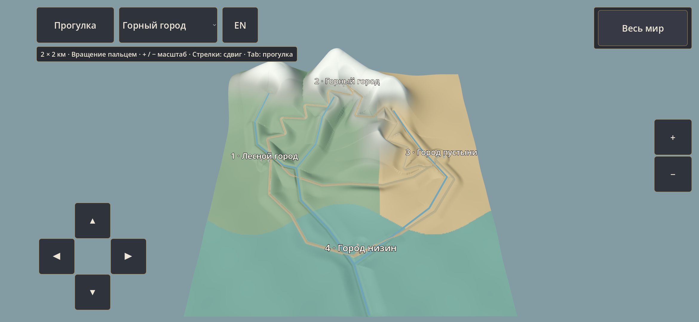
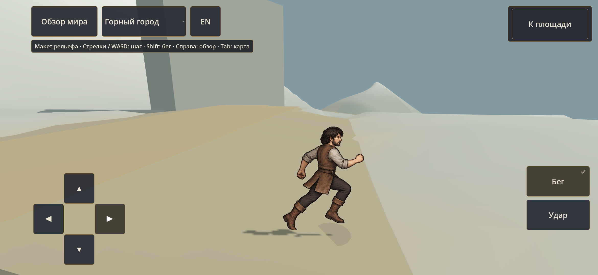

# WORLD-GRAYBOX-01 — проверка 0.21.0

23 сентября 2026. База `2785246`, отдельная ветка `codex/world-graybox`, D-061. [Исходники и воспроизведение](../../art/world/graybox-v1/README.md), [карточка](WORLD_GRAYBOX_01_TASK.md).

Исполнение: локальный qwen3.8-24k создал сборщики сетки, полос и откосов. Codex подготовил высоты/ограничения, интеграцию сцены, камеры/ввод/локализацию, экспорт и отдельный проход QA. Это собственная приёмка интеграционного кода, не внешнее ревью. После ограниченных возвратов координатор исправил направление треугольников и отсутствующий API нормалей; реальные журналы сохранены в `.tools/ollama-godot/runs/` основного checkout. Повторные чтения исчерпали лимит последнего возврата без записи; это отдельно от ошибки API.

## Проверки

- Земля: полные/неполные участки, повторная сборка, швы, верхняя сторона и совпадение рельефа с коллизией; полосы по X/Z, наклонный откос, отсутствие коллизии воды.
- Проверяется каждый узел покрытий; пять основных дорог и три подъезда проходятся в обе стороны настоящим CharacterBody3D. На пути нет телепортаций между точками. Ускорение QA ×10, физика 120 Гц (игровой шаг до 1/12 с); это не измерение обычного времени путешествия.
- Поперечный проход с земли через обе обочины и обратно выполняется с обычным временем; проверены четыре безопасные точки старта, очистка движения/бега при смене режима, сброс жеста при потере фокуса, пределы масштаба, перевод и границы интерфейса.
- Принятые рисунки и масштаб героя проверяются отдельно по опоре из 40 хешей. Зелёные тесты не означают художественного утверждения мира.

Результат: **PASS** на ПК и **Samsung S23 SM-S911B / RFCX11JX0PW**, Vulkan Mobile. В каждом полном прогоне — 16/16 маршрутов, 0 ошибок; максимальное зарегистрированное расстояние ног до поверхности в ускоренном прогоне 0,595 м. Обычные поперечные проходы обеих обочин также PASS. Отчёты `pc-headless/results.json`, `s23-final/results.json`; журналы проверены на ошибки скрипта и завершение всех сценариев.

Графический ПК: 1280×720 и 1200×900, EN/RU и точки старта просмотрены. Финальный EXE отдельно запущен до WORLD_GRAYBOX_READY без ошибок. На S23 обычная APK установлена, version/code сверены, SHA файла установленной `base.apk` совпадает с указанным ниже. Реальным вводом ADB проверены выбор горного города, переход обзор↔герой, вращение/масштаб, ходьба/бег/остановка, Home/возврат со снятым переключателем бега. Снимки `phone-running-recheck.png`, `phone-stopped-recheck.png`, `phone-resume-check.png`, `phone-handoff-final.png`; журнал PID 31257 без SCRIPT ERROR/FATAL EXCEPTION. Первый записанный 12-секундный эпизод оказался в режиме обзора и не считается доказательством бега; бег проверен повторно свежими снимками.

После полного маршрута менялись только отступы меню выбора города, отсечение эмулированной мыши в обзоре и завершающая пустая строка сборщика. Для конечного кода повторены графические проверки/эмуляция касания на ПК и обычный ввод установленной APK; повтор всех маршрутов ради этих изменений не заявляется. Все 40 хешей принятого героя и 12 локальных файлов владельца сохранены, повторная генерация данных даёт прежние хеши. 274 локальные ссылки документации проверены; 758 исходных файлов совпали с манифестом конечного экспорта (изменённые владельцем `.import` сверены отдельно).

На телефоне оставлен общий обзор RU; после передачи автоматические касания прекращены. OnePlus не подключён. Художественная оценка/масштаб со стороны владельца ещё не получены.

## Сборки

Обычная APK: `ashbound-world-graybox-preview.apk`, package `org.ashbound.worldgraybox`, version **0.21.0-world-graybox**, code **50**.

SHA256 APK: `7a0684289456ef7310c57597296730a21f9a3c9703b211c6a733d1ff8931cec6`.

Windows: `AshBound-World-Graybox.exe`, SHA256 `161771f39cfe7885a23be198f9dcd7fd833b891351a92dac5b21140651a63f79` (PCK встроен в EXE).

Отдельная QA APK: package `org.ashbound.worldgrayboxvalidation`, SHA256 `6b959fa05a182b1d8389ccdb6f98b1f9d229642be240cead5ca982a845ca0b21`.

Артефакты, журналы, отчёты и снимки сохраняются в `.tools/world-graybox-checks/` и `.tools/builds/` рабочего checkout, затем копируются в `.tools/world-graybox-0.21.0/` основного. Main не меняется; прежние приложения/сохранения и локальные файлы владельца сохраняются.

## Оценка и ограничения

Просмотрены общий рельеф и площадки: четыре региона, связи и перепады различимы, герой использует принятую опору, подсказка читается на снегу. Пойманы и устранены обратная сторона сетки, зависшая вода, складки острых поворотов, земля над соседней дорогой и ступенька у обочины. Мосты и города пока условные формы; набор не является готовым художественным окружением или кампанией. Дальнейшую детализацию ограничивать одним участком после оценки масштаба владельцем. CONS остаётся открыт.

